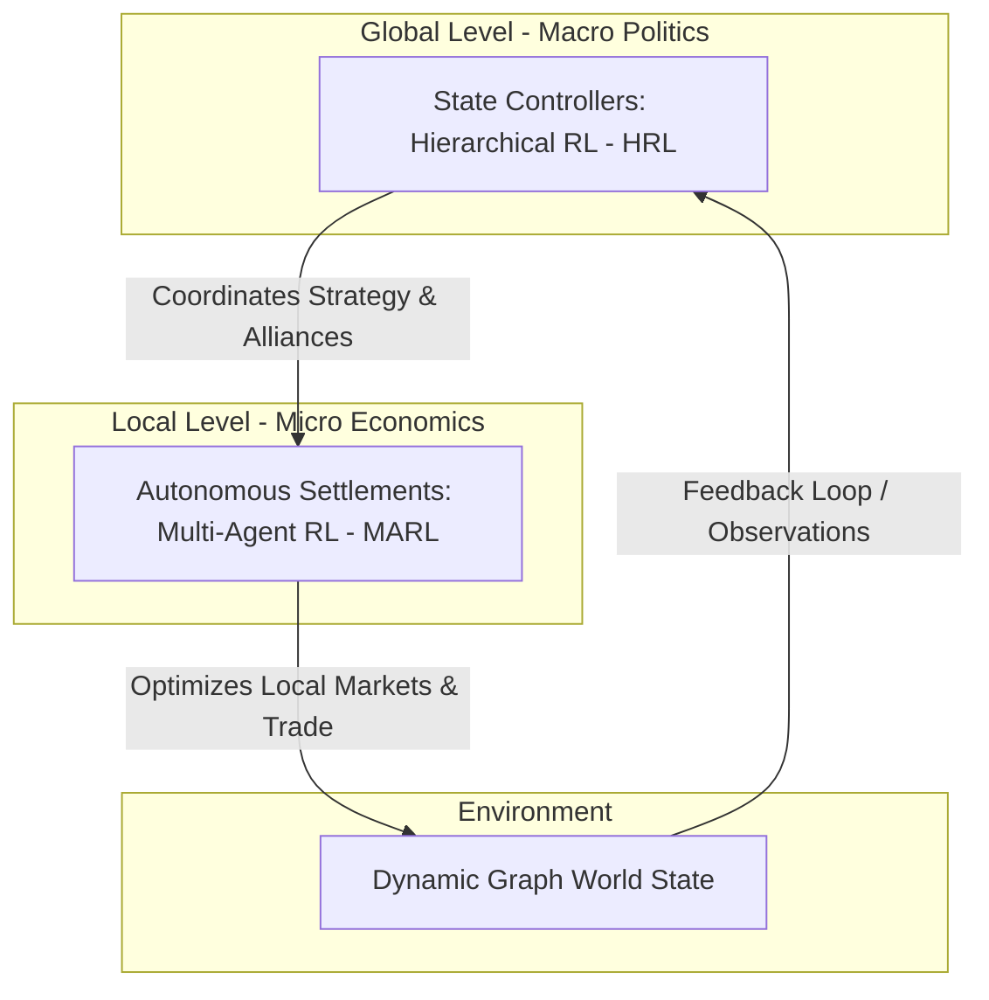

# MARL Grand Strategy Simulation

> **A multi-agent system for simulating geopolitical and economic processes in a game environment.**  
> B.Sc. Team Engineering Thesis | Academic Year 2026/2027  
> **Institution:** Warsaw University of Technology  
> **Faculty:** Faculty of Mathematics and Information Science (MiNI)  
> **Field of Study:** Computer Science and Information Systems (Informatyka i Systemy Informacyjne)

---

## Project Overview

This project focuses on the design, implementation, and evaluation of a complex, multi-agent simulation environment modeling geopolitical and economic processes within a grand strategy game framework. 

The simulated world is structured as a **dynamic graph**, where:
*   **Nodes** represent territorial units (autonomous settlements).
*   **Edges** model time-varying supply chains, trade routes, and diplomatic relations.

The goal is to develop highly scalable simulation architecture capable of handling structural graph changes while processing simultaneous AI actions at different layers of abstraction.

---

## AI Architecture & Decision System

The core Innovation of the project is a hybrid, **two-level hierarchical decision system** that bridges microeconomics and macro-level geopolitics using Reinforcement Learning:


---

## Project Structure

```
marl_grand_strategy/
├── .github/workflows/ci.yml
│
├── docs/                          # Documentation
│   ├── architecture/              # Diagrams and architecture overview
│   ├── ai/                        # Models
│   ├── api/                       # Communication
|   ├── decisions/                 # Key development decisions      
│   └── thesis/                    
│
├── tests/                         # End-to-end tests
│   ├── rust/          
│   └── python/         
│
├── core/                          # [RUST] Domain and Buisness Logic
│   └── src/
│       ├── domain/                # Model
│       ├── ports/                 # Interfaces
│       └── services/              # Controller
│
├── adapters/                      # [RUST] Infrastructure
│   ├── Cargo.toml
│   └── src/
│       ├── ai_client/             # Port for ai
│       └── view/                  # View
│          
├── ml_brain/                      # [PYTHON] MARL/HRL
│   └── src/
│       ├── env/                   # Environment
│       ├── models/                # Model
│       └── trainers/              # Controller
│
└── main_app/                      # [RUST] Entry point
    └── src/
        └── main.rs               
```