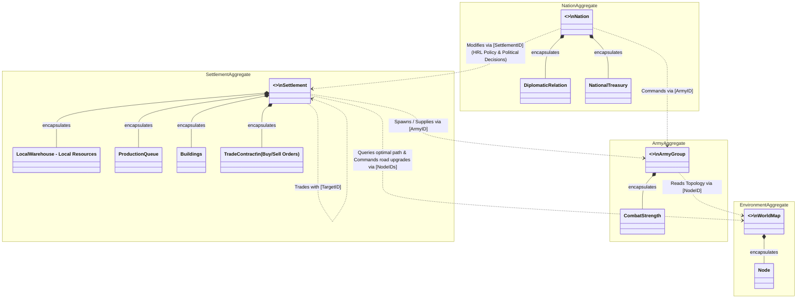

- **Nation Aggregate (Macro-Controller):** Represents the HRL model or the Player. It manages the global treasury and diplomatic relations. It steers the economy by imposing policies on Settlements and issues strategic commands to Armies.

- **Settlement Aggregate (Economic Engine):** The core MARL agent. It is entirely responsible for its internal micro-economy: managing the local warehouse, production queues, building construction, and executing trade contracts. It also handles the spawning and supplying of Armies.
    
- **Army Aggregate (Military Unit):** An independent military entity encapsulating combat strength and status. While it is spawned and supplied by a Settlement, its movement and combat orders are strictly dictated by the Nation.
    
- **Environment Aggregate (World Map):** The spatial representation of the game world. It consists of nodes (hexes/regions). It is primarily queried by Settlements for optimal trade pathfinding and by Armies for movement topology.