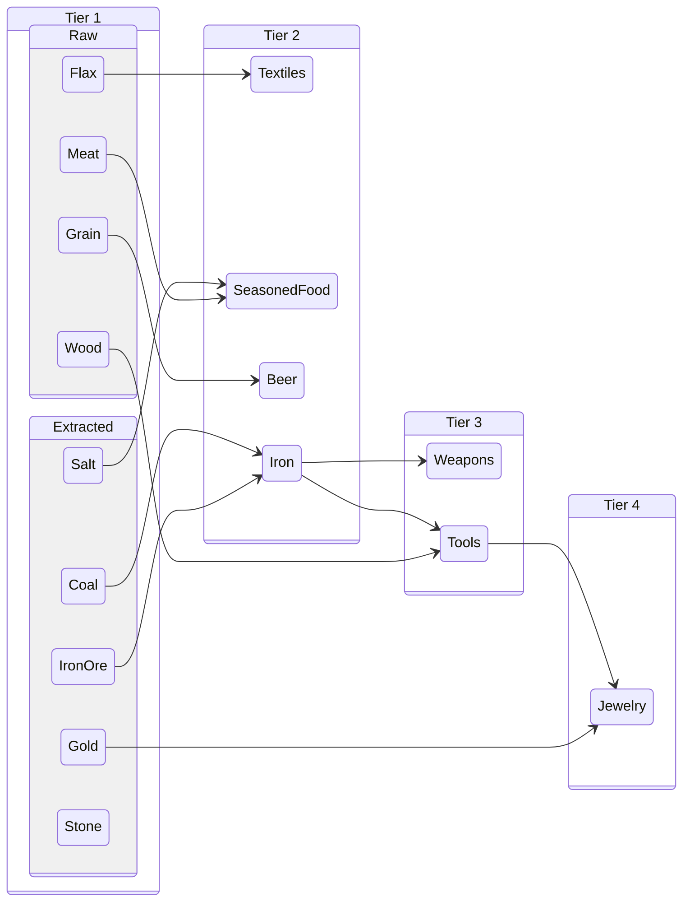
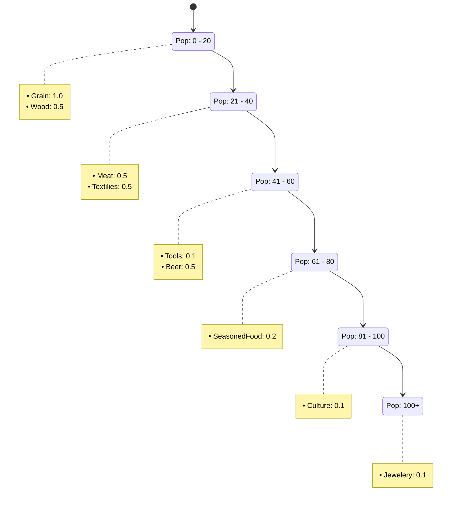

```mermaid
flowchart TD
    %% Definicja stylów dla węzłów
    classDef t1Node fill:#e8f5e9,stroke:#2e7d32,stroke-width:2px,color:#000
    classDef t2Node fill:#eeeeee,stroke:#616161,stroke-width:2px,color:#000
    classDef t3Node fill:#fff3e0,stroke:#e65100,stroke-width:2px,color:#000

    subgraph Tier1 ["TIER 1(Cost: Wood)"]
        direction TB
        %% Core Infrastructure
        TownCenter1[Village Center]:::t1Node
        Housing1[Wooden Huts]:::t1Node
        Storage1[Small Stockpile]:::t1Node
        Outpost1[Watchtower]:::t1Node
        
        %% Resource Gatherers
        Lumberjack1[Lumbercamp]:::t1Node
        Farm1[Crop Fields]:::t1Node
        Pasture1[Livestock Pen]:::t1Node
        Quarry1[Stone Pit]:::t1Node
        Weaver1[Spinning Wheel]:::t1Node
    end

    subgraph Tier2 ["TIER 2(Cost: Wood + Stone)"]
        direction TB
        %% Core Infrastructure
        TownCenter2[Town Hall]:::t2Node
        Housing2[Stone Houses]:::t2Node
        Storage2[Warehouse]:::t2Node
        Market2[Market Square]:::t2Node
        Outpost2[Stone Keep]:::t2Node
        
        %% Advanced Production & New Gatherers
        Mine1[Basic Mine]:::t2Node
        Smelter1[Bloomery/Smelter]:::t2Node
        Brewery1[Brewery]:::t2Node
        Smokehouse1[Smokehouse]:::t2Node
        Weaver2[Textile Workshop]:::t2Node
    end

    subgraph Tier3 ["TIER 3(Cost: Wood + Stone + Tools)"]
        direction TB
        %% Core Infrastructure
        TownCenter3[City Council]:::t3Node
        Housing3[Multi-story Estates]:::t3Node
        Storage3[Grand Vault]:::t3Node
        Market3[Trade Hub]:::t3Node
        Outpost3[Fortress]:::t3Node
        Culture1[Culture Center]:::t3Node
        
        %% End-game Production
        Mine2[Deep Shaft Mine]:::t3Node
        Smelter2[Blast Furnace]:::t3Node
        Blacksmith1[Blacksmith/Armory]:::t3Node
        Jeweler1[Jeweler]:::t3Node
    end

    %% UPGRADE PATHS (Logical progressions)
    
    %% Core Upgrades
    TownCenter1 -.->|Upgrade| TownCenter2
    TownCenter2 -.->|Upgrade| TownCenter3
    
    Housing1 -.->|Upgrade| Housing2
    Housing2 -.->|Upgrade| Housing3
    
    Storage1 -.->|Upgrade| Storage2
    Storage2 -.->|Upgrade| Storage3
    
    Outpost1 -.->|Upgrade| Outpost2
    Outpost2 -.->|Upgrade| Outpost3
    
    %% Market appears in T2, upgrades in T3
    Market2 -.->|Upgrade| Market3

    %% Production Upgrades (Only when mechanically logical)
    Weaver1 -.->|Upgrade| Weaver2
    Mine1 -.->|Upgrade| Mine2
    Smelter1 -.->|Upgrade| Smelter2
    
    %% Implicit Rules (No direct lines needed, but conceptually true)
    %% Lumbercamp, Farm, Pasture, Quarry stay as T1 base structures. 
    %% You build more of them rather than upgrading a "Farm Level 3".
    
    %% New buildings introduced in specific Tiers
    %% Brewery, Smokehouse introduced in T2 (No upgrades needed)
    %% Blacksmith, Jeweler, Culture Center introduced in T3

    %% Style dla teł Tierów (Paski poziome)
    style Tier1 fill:#f1f8e9,stroke:#33691e,stroke-width:2px,stroke-dasharray: 5 5
    style Tier2 fill:#fafafa,stroke:#424242,stroke-width:2px,stroke-dasharray: 5 5
    style Tier3 fill:#fff8e1,stroke:#ff6f00,stroke-width:2px,stroke-dasharray: 5 5
```

Handel
Osady maj

| **Name               | **Wood** | **Stone** | **Tools** | Worker Capacity | **Production** |
| :------------------- | :------: | :-------: | :-------: | --------------- | -------------- |
| **Village Center**   |          |           |     -     | -               |                |
| **Town Hall**        |          |           |     -     | -               |                |
| **City Council**     |          |           |           | -               |                |
| **Huts**             |          |     -     |     -     | -               |                |
| **Hause**            |          |           |     -     | -               |                |
| **Estate**           |          |           |           | -               |                |
| **Stockpile**        |          |     -     |     -     | -               |                |
| **Warehouse**        |          |           |     -     | -               |                |
| **Vault**            |          |           |           | -               |                |
| **Market**           |          |           |     -     |                 |                |
| **Trade Hub**        |          |           |           |                 |                |
| **Watchtower**       |          |     -     |     -     |                 |                |
| **Keep**             |          |           |     -     |                 |                |
| **Castle**           |          |           |           |                 |                |
| **Lumbercamp**       |          |     -     |     -     |                 |                |
| **Field**            |          |     -     |     -     |                 |                |
| **Livestock**        |          |     -     |     -     |                 |                |
| **Querry**           |          |     -     |     -     |                 |                |
| **Textile Workshop** |          |     -     |     -     |                 |                |
| **Brewery**          |          |           |     -     |                 |                |
| **Smokehause**       |          |           |     -     |                 |                |
| **Mine**             |          |           |     -     |                 |                |
| **Deep Mine**        |          |           |           |                 |                |
| **Smelter**          |          |           |     -     |                 |                |
| **Furnace**          |          |           |           |                 |                |
| **Blacksmith**       |          |           |     -     |                 |                |
| **Manofacture**      |          |           |           |                 |                |
| **Jewelery**         |          |           |           | 10              |                |
| **Culture Center**   |          |           |           | 10              |                |
